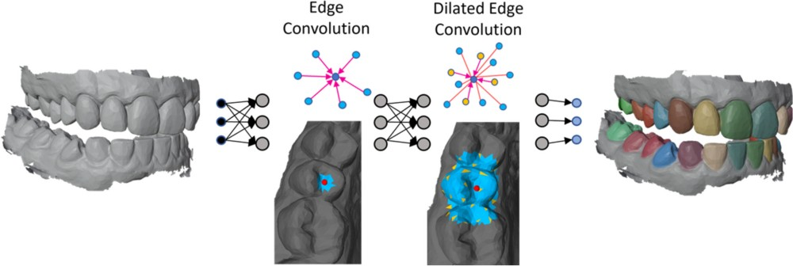

# DilatedToothSegNet: Tooth Segmentation Network on 3D Dental Meshes Through Increasing Receptive Vision

  

This repository contains the code for the journal paper: <br>
**DilatedToothSegNet: Tooth Segmentation Network on 3D Dental Meshes Through Increasing Receptive Vision <br>
Authors: Lucas Krenmayr, Reinhold von Schwerin, Daniel Schaudt, Pascal Riedel, Alexander Hafner** <br>
This paper is published in the Journal of Imaging Informatics in Medicine (JIIM) and can be accessed [here](https://link.springer.com/article/10.1007/s10278-024-01061-6).

 

## Abstract
*The utilization of advanced intraoral scanners to acquire 3D dental models has gained significant popularity in the fields of dentistry and orthodontics. Accurate segmentation and labeling of teeth on digitized 3D dental surface models are crucial for computer-aided treatment planning. At the same time, manual labeling of these models is a time-consuming task. Recent advances in geometric deep learning have demonstrated remarkable efficiency in surface segmentation when applied to raw 3D models. However, segmentation of the dental surface remains challenging due to the atypical and diverse appearance of the patients’ teeth. Numerous deep learning methods have been proposed to automate dental surface segmentation. Nevertheless, they still show limitations, particularly in cases where teeth are missing or severely misaligned. To overcome these challenges, we introduce a network operator called dilated edge convolution, which enhances the network’s ability to learn additional, more distant features by expanding its receptive field. This leads to improved segmentation results, particularly in complex and challenging cases. To validate the effectiveness of our proposed method, we performed extensive evaluations on the recently published benchmark data set for dental model segmentation Teeth3DS. We compared our approach with several other state-of-the-art methods using a quantitative and qualitative analysis. Through these evaluations, we demonstrate the superiority of our proposed method, showcasing its ability to outperform existing approaches in dental surface segmentation.*

## How to use this repository:

You can either use this repository to train the model from scratch using the Teeth3DS dataset or if you are just interested in the model architecture, you can find the model architecture in the *models* directory. The model is implemented in PyTorch and can be used in your own projects.
Example usage:
```python
import torch
from models.dilated_tooth_seg_network import DilatedToothSegmentationNetwork

# Create the model
model = DilatedToothSegmentationNetwork(num_classes=17, feature_dim=24).cuda()
# dummy input
pos = torch.rand(2, 2048, 3).cuda() # xyz coordinates of the points. Shape: (batch_size, num_points, 3)
x = torch.rand(2, 2048, 24).cuda() # features of the points. Shape: (batch_size, num_points, feature_dim)

out = model(x, pos)
print(out.shape) # Shape: (batch_size, num_points, num_classes)
```


### Requirements
- Python 3.10
- PyTorch >= 2.1
- CUDA >= 12.0
- see requirements.txt for additional dependencies

### Docker (Recommended)
It is recommended to use the provided Dockerfile to run the code. The Dockerfile contains all necessary dependencies and spins up a jupyter instance. I can be built using the following command:
```bash
docker build -t dilatedtoothsegnet .
```

The Docker container can be started using the following command: <br>
On **Windows**:
```cmd
docker run -p 8888:8888 -p 6006:6006 -e JUPYTER_TOKEN=12345 -d --gpus all -v "%cd%:/app" --name dilatedtoothsegnet dilatedtoothsegnet
```
On **Linux**:
```bash
docker run -p 8888:8888 -p 6006:6006 -e JUPYTER_TOKEN=12345 -d --gpus all -v "$(pwd):/app" --name dilatedtoothsegnet dilatedtoothsegnet
```

Afterwards a jupyter notebook can be started by opening the following link in a browser: http://localhost:8888/?token=12345 <br>
To finish the installation, open a terminal in the jupyter notebook and run the following command. This will install the PointNet++ Ops Library, which is required for the code to run.
```bash
cd pointnet2_ops_lib
python setup.py install
```

### Local Installation
To install the required dependencies, run the following command:
```bash
pip install -r requirements.txt
```
Install PointNet++ Ops Library:
```bash
pip install ninja
cd pointnet2_ops_lib
python setup.py install
```

### Data
The data used in this project is the Teeth3DS dataset, which can be downloaded from [here](https://github.com/abenhamadou/3DTeethSeg22_challenge) <br>
The data should be placed in the data directory in the following structure:
```
data
    |3dteethseg
        | raw
            | lower
            | upper
            | private-testing-set.txt
            | public-training-set-1.txt
            | public-training-set-2.txt
            | testing_lower.txt
            | testing_upper.txt
            | training_lower.txt
            | training_upper.txt

```
When running the training script, it will automatically preprocess the data and save it in the processed directory (data/processed).

### Training
To train the model, run the following command with the desired options:
```bash
python train_network.py --epochs 100 --tb_save_dir logs --experiment_name training --experiment_version 1 --train_batch_size 2 --n_bit_precision 16 --train_test_split 1 --devices 0
```

To see the training progress, you can use TensorBoard by running the following command in the terminal:
```bash
tensorboard --logdir <path_to_tensorboard_logs> --port 6006 --host 0.0.0.0
```
Then open a browser and navigate to http://localhost:6006

Options:

```--epochs <number>```: The number of epochs to train for. Default is 100. <br>
```--tb_save_dir <path>```: The directory to save TensorBoard logs to. Default is tensorboard_logs. <br>
```--devices <devices>```: The device ids to use for training. If multiple devices are used, they should be separated by space (e.g 0 1 2). Default is 0. <br>
```--experiment_name <name>```: The name of the experiment. <br>
```--experiment_version <version>```: The version of the experiment. <br>
```--train_batch_size <size>```: The batch size for training. Default is 2. <br>
```--n_bit_precision <number>```: The precision for training. Default is 16. <br>
```--train_test_split <number>```: The option for train/test split. Either 1 or 2. Default is 1. <br>
```--ckpt <path>```: The path to a checkpoint to resume training from. Default None <br>

### Evaluation
To evaluate the model, run the following command with the desired options. The checkpoint path should be the path to the checkpoint to evaluate.
This will save the results in the log directory as a .csv file.
```bash
python test_network.py --tb_save_dir logs --experiment_name testing --experiment_version 1 --devices 0 --n_bit_precision 16 --train_test_split 1 --ckpt <path_to_checkpoint>
```
Options:
  
```--experiment_name <name>```: The name of the experiment. <br>
```--experiment_version <version>```: The version of the experiment. <br>
```--devices <devices>```: The device ids to use for training. If multiple devices are used, they should be separated by space (e.g 0 1 2). Default is 0. <br>
```--n_bit_precision <number>```: The precision for training. Default is 16. <br>
```--train_test_split <number>```: The option for train/test split. Either 1 or 2. Default is 1. <br>
```--ckpt <path>```: The path to a checkpoint to evaluate. <br>

### Inferencing
To use the model for inferencing on a single instance of the data set, run the following command with the desired options. The checkpoint path should be the path to the checkpoint to use for inferencing.
The predicted and ground truth color-coded meshes will be saved in the output directory as .ply files. You can visualize the results using MeshLab or other 3D mesh like [https://3dviewer.net/](https://3dviewer.net/).
```bash
python visualize_example.py --ckpt <path_to_checkpoint> --out_dir output --n_bit_precision 16 --use_gpu  --train_test_split 1 --data_idx 0
```

Options: 
  
  ```--ckpt <path>```: The path to a checkpoint to use for inferencing. <br>
  ```--out_dir <path>```: The directory to save the output to. Default is output. <br>
  ```--n_bit_precision <number>```: The precision. Default is 16. <br>
  ```--use_gpu```: Use this flag to use the GPU for inferencing. <br>
  ```--train_test_split <number>```: The option for train/test split. Either 1 or 2. Default is 1. <br>
  ```--data_idx <number>```: The index of the data to use for inferencing. Default is 0. <br>


## Special Thanks
The code in this repository is based on the following repositories:
- [DGCNN](https://github.com/antao97/dgcnn.pytorch)
- [PointNet2](https://github.com/erikwijmans/Pointnet2_PyTorch)
- [PointNet](https://github.com/yanx27/Pointnet_Pointnet2_pytorch)
- [MeshSegNet](https://github.com/Tai-Hsien/MeshSegNet)
- [TSGCNet](https://github.com/ZhangLingMing1/TSGCNet)

We would like to thank the authors of these repositories for providing their code.

## Citation
If you find this work useful, please cite this paper:
Krenmayr, L., von Schwerin, R., Schaudt, D. et al. DilatedToothSegNet: Tooth Segmentation Network on 3D Dental Meshes Through Increasing Receptive Vision. J Digit Imaging. Inform. med. (2024). https://doi.org/10.1007/s10278-024-01061-6
```
@article{krenmayr2024dilatedtoothsegnet,
  title={DilatedToothSegNet: Tooth Segmentation Network on 3D Dental Meshes Through Increasing Receptive Vision},
  author={Krenmayr, Lucas and von Schwerin, Reinhold and Schaudt, Daniel and Riedel, Pascal and Hafner, Alexander},
  journal={Journal of Imaging Informatics in Medicine},
  pages={1--17},
  year={2024},
  publisher={Springer},
  doi={10.1007/s10278-024-01061-6}
}


